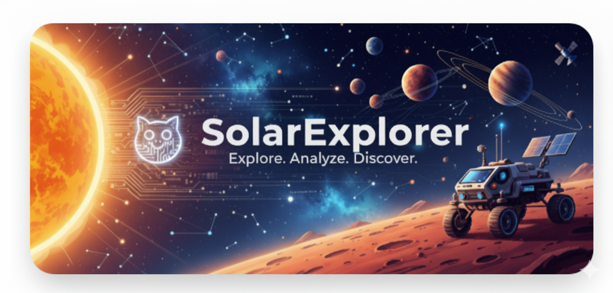

# 🌌 Solar System Explorer

_A CSS-only interactive Solar System demonstrating responsive design and creative front-end engineering._

An interactive, responsive, and visually stunning **Solar System Explorer** built entirely with **HTML and CSS** — no JavaScript required.

This project is designed as a **portfolio-ready showcase**, highlighting front-end creativity and advanced CSS techniques that are highly relevant for UI/UX, front-end development, and creative coding roles.

---

## ✨ Project Overview

The **Solar System Explorer** provides an immersive visual experience of our solar system.
It demonstrates:

- 🌍 **CSS-driven interactivity** – Orbits, rotations, and hover effects.
- 📱 **Responsive web design** – Works seamlessly across devices.
- 🎨 **Creative front-end engineering** – Built without JavaScript, frameworks, or external libraries.

---

## 🎯 Features

- 🌍 **Interactive Planets** – Smooth orbits & realistic rotations.
- 📱 **Responsive Design** – Mobile-first and adaptive across screen sizes.
- 🎨 **CSS-Only Animations** – No JavaScript used.
- 🌌 **Space-Themed UI** – Dark starry background for an immersive feel.
- ⚡ **Lightweight & Optimized** – Fast performance using pure HTML & CSS.

---

## 🧑‍💻 Skills Demonstrated

- **CSS Animations & Keyframes** – Creating realistic orbits and rotations.
- **Responsive Web Design** – Adaptive layouts using flexbox & media queries.
- **Semantic HTML5** – Structuring accessible and clean markup.
- **UI/UX Design** – Crafting a visually engaging and interactive experience.
- **Performance Optimization** – Building lightweight apps without external libraries.

---

## 📸 Screenshots & Demo

### Solar System View


### Animated Orbits


---

## 🚀 Live Demo

👉 [Solar System Explorer - GitHub Pages](https://divyansh3105.github.io/Solar-System-Explorer/)

---

## 🛠️ Technologies Used

- **HTML5** – Semantic structure
- **CSS3** – Flexbox, Media Queries, Transforms, Keyframe Animations

---

## 📖 Why This Project Matters

This project demonstrates **advanced use of CSS animations, responsive design, and interactivity without JavaScript**.
It is resume-ready because it highlights:

- Problem-solving with limited tools (HTML + CSS only).
- Creativity in UI/UX design.
- Ability to build **interactive, modern web apps without dependencies**.

---

## 📂 Repository Structure

```
Solar-System-Explorer/
│── index.html      # Main HTML file
│── style.css       # CSS animations and responsive design
│── Media/          # Banner, screenshots, GIF demos
```

---

## 🤝 Contributing

Contributions and suggestions are welcome! Fork this repo and submit a PR to improve responsiveness, add more planets, or refine animations.

---

## 📜 License

This project is open-source and available under the **MIT License**.

---

## 👨‍💻 Author

**Divyansh Garg**

- 🌐 [Portfolio](https://divyansh3105.github.io/Portfolio/)
- 💼 [LinkedIn](www.linkedin.com/in/divyanshgarg3105)
- 💻 [GitHub](https://github.com/Divyansh3105)

---

⭐ If you like this project, consider giving it a **star** on GitHub!
