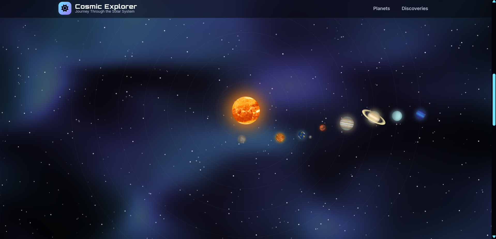

# 🌌 Solar System Explorer


---


> _A fully **CSS-powered interactive Solar System** with responsive design, orbit animations, and visually stunning effects—no JavaScript required._

---

## 📌 Project Overview

The **Solar System Explorer** is an interactive, CSS-only project that visualizes our solar system with **responsive design, orbiting animations, and hover interactions**. This project demonstrates advanced **CSS animation skills and front-end creativity**.

## 📖 Description

The project features a fully interactive solar system, including:

- 🌞 The Sun at the center with glow effects
- 🌍 All major planets with realistic sizes and rotations
- 🪐 Saturn's rings and dynamic orbit animations
- 🖱️ Hover interactivity showing planet information
- 📱 Responsive layout compatible with mobile, tablet, and desktop screens

🌐 **Live Demo:** [Solar System Explorer](https://solarexplorers.netlify.app/)

💻 **GitHub Repo:** [Divyansh3105/SolarExplorer](https://github.com/Divyansh3105/SolarExplorer)

---

## 🚀 Features

- 🌌 CSS-only orbit and rotation animations for planets
- 📱 Fully responsive and mobile-first design
- 🖼️ Interactive planet info on hover
- 🎨 Dark space theme with glowing effects
- ⚡ Lightweight and optimized, no JavaScript dependencies
- 🌍 Deployed on GitHub Pages for easy access

---

## 🛠️ Tech Stack

- **Frontend:** HTML5, CSS3 (Flexbox, Grid, Keyframes, Media Queries)
- **Deployment:** GitHub Pages / Netlify
- **Version Control:** Git & GitHub

---

## 🧩 Skills & Techniques Demonstrated

- **CSS Animations & Transforms** – Orbits, rotations, and hover effects.
- **Responsive Web Design** – Media queries and flexible layouts.
- **Semantic HTML5 Structure** – Accessible and maintainable markup.
- **UI/UX Design Principles** – Visual hierarchy, interactive elements, and immersive experience.
- **Performance Optimization** – Minimalistic code with high visual impact.
- **Creative Problem Solving** – Building complex interactions without JavaScript.

---

## 📂 Project Structure

```
Solar-System-Explorer/
│── index.html       # Main HTML file
│── style.css        # CSS animations & responsive layout
│── Media/           # Banner, screenshots, GIF demos
|-- Earth/           # Earth page HTML and CSS
|-- Jupiter/         # Jupiter page HTML and CSS
|-- Mars/            # Mars page HTML and CSS
|-- Mercury/         # Mercury page HTML and CSS
|-- Neptune/         # Neptune page HTML and CSS
|-- Saturn/          # Saturn page HTML and CSS
|-- Sun/             # Sun page HTML and CSS
|-- Uranus/          # Uranus page HTML and CSS
|-- Venus/           # Venus page HTML and CSS
│── README.md        # Project documentation
```

---

## 📸 Screenshots

### 🔹 Solar System View



### 🔹 Animated Orbits


---

## 📖 How to Run Locally

1. Clone the repository:
   ```bash
   git clone https://github.com/Divyansh3105/SolarExplorer.git
   ```
2. Navigate to the project folder:
   ```bash
   cd Solar-System-Explorer
   ```
3. Open `index.html` in your browser.

---

## 🎯 Purpose of the Project

This project was developed to:

- Demonstrate **multi-element CSS animations** without JavaScript
- Showcase **responsive and interactive UI design** skills
- Provide a **portfolio-ready project** highlighting front-end creativity

---

## 📌 Future Enhancements

- 🌑 Add **moon and asteroid animations**
- 🌟 Implement **dynamic light & shadow effects**
- 🛰️ Include **interactive planetary info panels** with fun facts
- 🎨 Dark/Light mode toggle for better user experience

---

## 🤝 Contributing

Contributions and suggestions are welcome! Fork this repo and submit a PR to improve responsiveness, add more planets, or refine animations.

---

## 📜 License

This project is open-source and available under the **MIT License**.

---

## 👨‍💻 Author

**Divyansh Garg**

- 🌐 [Portfolio](https://divyansh3105.github.io/Portfolio/)
- 💼 [LinkedIn](www.linkedin.com/in/divyanshgarg3105)
- 💻 [GitHub](https://github.com/Divyansh3105)

---

⭐ If you like this project, consider giving it a **star** on GitHub!
